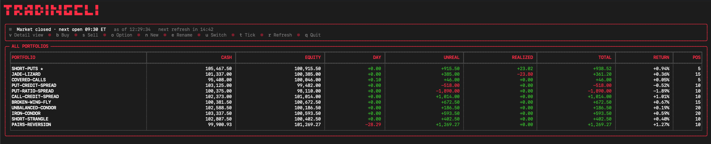
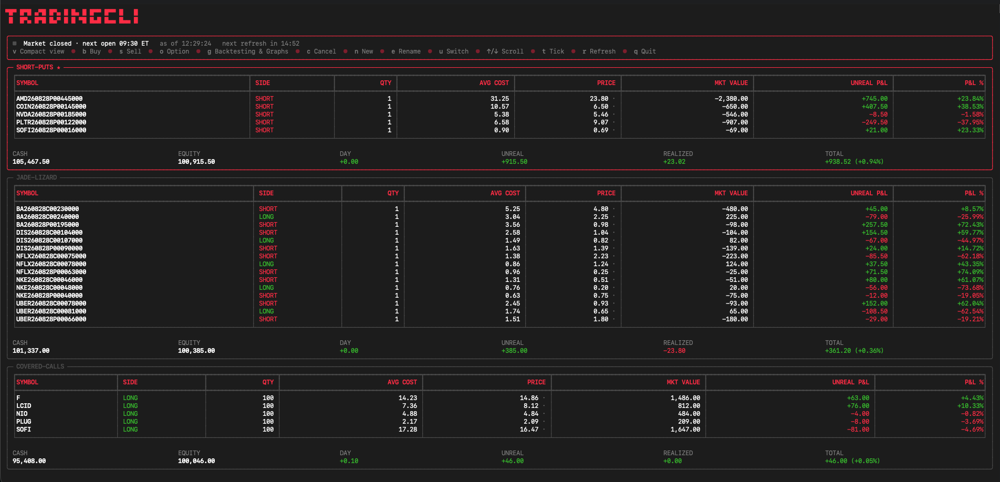
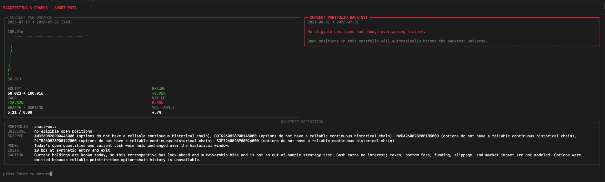

<div align="center">

# 📈 TradingCLI

**A fast, local-first paper-trading and market-simulation toolkit for your terminal.**

[](https://github.com/ryanrodrigues25200525-svg/tradingcli/actions/workflows/ci.yml)
[](https://www.python.org/)
[](LICENSE)
[](#scope-and-safety)
[](https://sqlite.org/)

Multi-account portfolios · advanced simulated orders · options and futures ·
terminal dashboard · backtesting · alerts · automation · MCP

</div>

> [!IMPORTANT]
> TradingCLI is strictly a **local paper-trading simulator**. It never routes
> orders to a live broker and is not a source of personalized financial advice.

## 🧠 What it actually is

TradingCLI gives you a **fake brokerage account that lives in one file on your
own machine**. You place orders against it, and it fills them using real market
prices from Yahoo Finance. There is no signup, no API key, and no path in the
code that reaches a real broker.

```text
        you  ·  or your AI agent
                    │
                    ▼
     tradingcli  (dashboard · commands · MCP server)
                    │
       ┌────────────┴────────────┐
       ▼                         ▼
 ~/.papertrade.db          Yahoo Finance
 accounts, orders,         prices only,
 positions, ledger         read-only
```

Three ways to drive it — they all share the same database:

| | How you start it | Best for |
| --- | --- | --- |
| 🖥️ **Dashboard** | `tradingcli` | Watching portfolios update live |
| ⌨️ **Commands** | `tradingcli buy AAPL 5` | Scripting, automation, one-off actions |
| 🤖 **MCP server** | `tradingcli-mcp` | Letting Claude or another agent trade — see [AI agents](#ai-agents) |

## 🖥️ Screenshots

| All portfolios | Position detail |
| --- | --- |
|  |  |



The captures come from a local paper-trading database; they contain no real
portfolio or credential data.

## ✨ Highlights

| Area | What is included |
| --- | --- |
| ⚡ Fast terminal UX | Roughly 20 ms median installed startup, persistent quote cache, offline-first dashboard |
| 💼 Portfolio simulation | Multiple accounts, deposits, withdrawals, P&L, time-weighted returns and reconciliation |
| 🧾 Advanced orders | Market, limit, stop, stop-limit, trailing, bracket, OCO, OTO and multi-leg options |
| 🌍 Instruments | Equities, ETFs, crypto, FX, futures and equity options |
| 🧪 Research | Current-holdings backtests, walk-forward SMA tests, portfolio optimization and performance metrics |
| 🔔 Local operations | Alerts, JSONL notifications, reports, quote streaming, scheduling, backups and encrypted copies |
| 🤖 Agent ready | Local stdio MCP server with core, advanced and compatibility profiles |
| 🛡️ Durable storage | SQLite WAL, fixed precision, 56 data guards, migration backups and owner-only permissions |

## 🧭 Contents

- [Scope and safety](#scope-and-safety)
- [Install](#install)
- [Quick start](#quick-start)
- [Dashboard and research](#dashboard-and-research)
- [Orders, options and market data](#orders-options-and-market-data)
- [Operations and simulation lab](#operations-and-simulation-lab)
- [MCP server](#mcp-server)
- [AI agents: a local alternative to Alpaca paper trading](#ai-agents)
- [Configuration](#configuration)
- [Development and verification](#development-and-verification)

<a id="scope-and-safety"></a>

## 🛡️ Scope and safety

TradingCLI is a local paper-trading simulator. It never places live brokerage
orders, and its Yahoo Finance data is not an exchange-grade feed. Do not use it
as the sole source for financial decisions or expose its stdio MCP server as an
unauthenticated network service.

Fetching prices, news, history, and option chains sends held, pending, or
watchlisted symbols to Yahoo Finance through `yfinance`. See
[SECURITY.md](SECURITY.md) for the local-data and network privacy model.

<a id="install"></a>

## 📦 Install

Requires Python 3.10 or newer.

```bash
python3 -m venv .venv
source .venv/bin/activate
python3 -m pip install .
tradingcli --version
```

For development:

```bash
uv sync --locked --extra dev
uv run python run_tests.py
```

`uv.lock` pins the complete cross-platform dependency graph. Use the locked
`uv` workflow for CI and repeatable deployments; the plain `pip` install above
is the lightweight end-user path.

<a id="quick-start"></a>

## 🚀 Quick start

Launch the dashboard and first-run setup wizard:

```bash
tradingcli
```

Examples:

```bash
tradingcli accounts
tradingcli buy AAPL 5
tradingcli positions
tradingcli market
tradingcli backtest --lookback-days 3650
```

Inspect all command families without touching market data:

```bash
tradingcli --help-all
tradingcli --schema
```

<a id="dashboard-and-research"></a>

## 📊 Dashboard and research

Press `g` in the dashboard to open **Backtesting & Graphs**. It puts the
selected portfolio's live performance curve next to a `backtesting.py`
backtest of the same holdings, reporting return, CAGR, volatility, Sharpe,
Sortino, costs, and maximum drawdown.

- **The universe is that account only.** Tickers come straight from that
  account's open positions in SQLite; another account's names never leak in.
- **Pick a window on open:** `6m`, `1y`, `2y`, `5y`, `10y`, `max`, or an exact
  number of days. Enter requests five years. CAGR uses the real elapsed
  calendar interval, not the requested one.
- **Returns are time-weighted,** so deposits and withdrawals cannot masquerade
  as trading gains or losses.

> [!WARNING]
> **Read the backtest for what it is.** It answers one narrow question: how
> today's open quantities and current cash *would have* performed if held
> unchanged over the chosen history. Because today's holdings are already known,
> it carries look-ahead and survivorship bias — it is **not** an out-of-sample
> strategy test. It uses adjusted daily Yahoo prices, skips options (reliable
> point-in-time option-chain history does not exist) and treats futures as
> continuous series with no roll costs.

<a id="orders-options-and-market-data"></a>

## 🧾 Orders, options and market data

Alpaca-style order lifecycle:

```bash
tradingcli order submit AAPL --side buy --qty 10 --type limit --limit-price 185
tradingcli order submit AAPL --side sell --qty 10 --type trailing-stop --trail-percent 3
tradingcli order get --order-id 1
tradingcli order replace 1 --limit-price 184
tradingcli order cancel-all
tradingcli order submit AAPL --side buy --qty 10 --type limit --limit-price 180 --dry-run
tradingcli position close AAPL --percent 50
tradingcli position close-all
```

Bracket, OCO, and OTO exits use `--take-profit`, `--stop-loss`, and optionally
`--stop-loss-limit`. Orders support quantity or notional sizing, client order
IDs, time-in-force values, and eligible extended-hours limit orders.

Options, watchlists, and research:

```bash
tradingcli option get AAPL270115C00100000
tradingcli option exercise AAPL270115C00100000
tradingcli option do-not-exercise AAPL270115C00100000
tradingcli watchlist create Tech --symbols AAPL,MSFT,NVDA
tradingcli watchlist quotes Tech
tradingcli calendar --start 2026-07-01 --end 2026-07-31
tradingcli data bars AAPL --timeframe 1Day --limit 30
tradingcli data snapshot AAPL
tradingcli data movers
```

Portfolio rebalance suggestions are available through the MCP
`rebalance_suggest` tool. They preserve the account's existing cash allocation,
optimize only eligible long spot holdings, and explicitly skip shorts, futures,
and options. When anything is skipped, the response is marked `ok_partial` and
defines its weight scope explicitly. It is model output—not personalized
investment advice.

<a id="operations-and-simulation-lab"></a>

## 🧰 Operations and simulation lab

An append-only double-entry ledger sits alongside the portfolio projection.
Funding, fills, commissions, and migrated opening balances are
balanced transactions; reconciliation can report or repair drift:

```bash
tradingcli ledger balances
tradingcli ledger reconcile
tradingcli ledger reconcile --repair
```

Execution simulation defaults to the legacy zero-cost/full-fill behavior.
Configure commissions, adverse slippage, liquidity participation, and a
maximum fill size per account:

```bash
tradingcli execution set --commission-bps 5 --slippage-bps 10 \
  --liquidity-fraction 0.5 --max-fill-quantity 100
tradingcli execution preview buy 250 185
```

Risk limits now include daily realized loss, peak-equity drawdown, per-symbol
exposure, and concentration:

```bash
tradingcli risk --max-daily-loss 1000 --max-drawdown 0.10 \
  --max-symbol-exposure 25000 --max-concentration 0.30
```

Research, journal, automation, and interchange commands:

```bash
tradingcli strategy walk-forward AAPL
tradingcli journal add "Earnings breakout" --tags setup,earnings --symbol AAPL
tradingcli journal attribution
tradingcli automation add nightly-backup backup --interval-seconds 86400
tradingcli automation run-due
tradingcli broker export alpaca
tradingcli broker import ibkr trades.csv
```

Automations are persisted and keep run history, but TradingCLI does not install
an operating-system daemon. Invoke `automation run-due` from cron, launchd, or
another trusted scheduler.

Local simulation operations include cache warming, streaming marks, alerts,
reports, performance diagnostics, and shell completion:

```bash
tradingcli quotes warm AAPL MSFT
tradingcli quotes stream AAPL MSFT --interval 5 --count 20 --check-alerts
tradingcli quotes daemon --interval 15 --check-alerts
tradingcli alert add aapl-breakout AAPL --above 225
tradingcli alert check --notify
tradingcli alert events
tradingcli report summary --save
tradingcli benchmark --iterations 20
tradingcli completion zsh > ~/.zfunc/_tradingcli
```

`quotes daemon` is a foreground local cache warmer; it never routes orders.
Alerts are stored in SQLite. `--notify` also appends triggered events to the
owner-private `~/.papertrade_notifications.jsonl` inbox. Automations accept
the additional safe actions `quotes`, `alerts`, and `report`.

Backups can be inventoried, retained, and restored. Restore requires `--yes`
and first creates another consistent safety backup:

```bash
tradingcli backup list
tradingcli backup prune --keep 10
tradingcli backup restore /path/to/backup.db --yes
```

Authenticated encrypted snapshots protect portable database copies while the
live SQLite file retains owner-only permissions:

```bash
PAPERTRADE_ENCRYPTION_PASSWORD='...' \
  tradingcli security encrypt-copy portfolio.db.enc
PAPERTRADE_ENCRYPTION_PASSWORD='...' \
  tradingcli security decrypt-copy portfolio.db.enc restored.db
```

An authenticated, loopback-only HTTP API exposes health, accounts, positions,
journal entries, and order previews. Tokens must be at least 24 characters:

```bash
PAPERTRADE_API_TOKEN='replace-with-a-long-random-token' tradingcli serve
```

Static or file-backed prices can precede Yahoo for deterministic simulations
or failover. Configure `PAPERTRADE_PRICE_PROVIDERS=file,static,yahoo`,
`PAPERTRADE_PRICE_FILE=./simulation-prices.json`,
`PAPERTRADE_STATIC_PRICES='{"AAPL":185.25}'`, and optionally
`PAPERTRADE_PRICE_CACHE_TTL` (15 seconds by default). Fresh Yahoo prices are
cached in SQLite, so separate terminal invocations can reuse them without
another network round trip. Set the TTL to `0` when every command must fetch.

Terminal quote, latest-trade, snapshot, and FX commands use a fast indicative
quote path with `bid` and `ask` equal to the latest price. Library callers can
request Yahoo's slower metadata lookup with
`latest_quote("AAPL", detailed=True)`.

Every command accepts one automation output flag: `--json`, `--csv`, or
`--quiet`. `--schema` returns the command tree without accessing market data,
and `doctor` checks physical integrity, logical relationships, fixed-precision
storage, schema compatibility, and active database guards.

<a id="mcp-server"></a>

## 🤖 MCP server

Start the MCP server over standard input/output:

```bash
python3 mcp_server.py
```

The server defaults to a focused **63-tool `core` catalog**: order preview and
lifecycle management, positions, watchlists, market data, `portfolio_backtest`,
health checks, and backups. Destructive account deletion and reset are
deliberately left out of that default surface. Every core response uses one
compact JSON contract:

```json
{"ok": true,  "data": {}}
{"ok": false, "error": {"code": "...", "message": "..."}}
```

Pick a broader catalog before starting the server if an agent needs one:

```bash
PAPERTRADE_MCP_PROFILE=advanced tradingcli-mcp  # 79 canonical tools
PAPERTRADE_MCP_PROFILE=full tradingcli-mcp      # all 86, legacy output
```

`advanced` adds destructive and specialist option/research/data operations.
`full` adds the seven old aliases (`buy`, `sell`, `cancel_order`,
`close_position`, `quote`, `trade_history`, and `watchlist`) for existing
clients; `compat` is an alias for `full`. Set
`PAPERTRADE_MCP_RESPONSE_FORMAT=json|legacy` to override a profile's response
format. The `mcp_catalog` tool reports the active contract and complete tool
list.

Mutating tools accept agent attribution and idempotency keys for safe retries
from multiple independent MCP processes.

Portfolio data defaults to `~/.papertrade.db`. Database files and sidecars are
forced to owner-only `0600`; the backup directory is `0700` and backups are
`0600`. Set `PAPERTRADE_DB` to use a different database path. Set
`PAPERTRADE_MARKET_TIMEOUT` to change the default 15-second timeout used by
historical-data requests.

<a id="ai-agents"></a>

## 🧪 AI agents: a local alternative to Alpaca paper trading

The usual way to let an AI agent practise trading is a hosted paper-trading
API such as Alpaca's: you sign up, mint keys, and every order the agent places
is a network call to someone else's server. TradingCLI does the same job with a
local SQLite file and a stdio MCP server.

### Why that matters for an agent

| | Hosted paper API | TradingCLI |
| --- | --- | --- |
| **Getting started** | Account signup, API keys the agent must be trusted with | `pip install .` — no account, no keys, no secrets to leak |
| **Where state lives** | A vendor's servers | `~/.papertrade.db` on your disk, owner-only `0600` |
| **When the network dies** | The agent's run dies with it | Orders still fill; only fresh prices need the network |
| **Rate limits** | Yes — a fast agent loop hits them | None; it is a local database write |
| **Reproducibility** | Live prices, so a run can never be replayed exactly | Pin prices with `PAPERTRADE_PRICE_FILE` or `PAPERTRADE_STATIC_PRICES` and replay a run byte-for-byte |
| **Number of accounts** | Constrained by the provider | As many as you want, in one database |
| **Blast radius** | A misconfigured key can point at a live endpoint | There is no live order path in the codebase |

### The safety rails an agent gets

- **A deliberately narrow default surface.** The `core` MCP profile exposes 63
  tools and leaves account deletion and reset out entirely. You opt into the
  destructive ones with `PAPERTRADE_MCP_PROFILE=advanced`.
- **One response contract.** Every core tool returns `{"ok":true,"data":...}`
  or `{"ok":false,"error":{...}}`, so an agent never has to parse prose.
- **Idempotency keys and agent attribution.** A retrying agent — or several
  agents in parallel MCP processes — cannot double-fill the same order.
- **Risk limits enforced in the engine, not in the prompt.** Daily loss,
  drawdown, per-symbol exposure and concentration caps reject the order rather
  than trusting the model to behave.
- **Realistic costs, so the agent does not learn on free fills.** Turn on
  commissions, slippage and liquidity participation with `execution set`.
- **A full audit trail.** Every fill lands in an append-only double-entry
  ledger you can reconcile, plus a journal with per-trade attribution.

### Getting an agent trading

```bash
tradingcli-mcp                                  # core profile, 63 tools
PAPERTRADE_DB=./agent-sandbox.db tradingcli-mcp # give the agent its own database
```

Point your MCP client at that command. To keep an agent's experiments away from
your own portfolios, give it a separate `PAPERTRADE_DB` — the two never see
each other. When you want the results elsewhere, `tradingcli broker export
alpaca` writes Alpaca-shaped fill CSVs.

> [!NOTE]
> **What this deliberately is not.** Yahoo Finance is not an exchange-grade
> feed: there is no order-book depth and no tick tape. Fills are modelled, not
> matched against a real queue. This is a place for an agent to learn a
> strategy and for you to audit its behaviour — moving anything to live capital
> is a separate, deliberate step that TradingCLI does not perform.

<a id="configuration"></a>

## ⚙️ Configuration

| Variable | Purpose | Default |
| --- | --- | --- |
| `PAPERTRADE_DB` | SQLite portfolio path | `~/.papertrade.db` |
| `PAPERTRADE_MARKET_TIMEOUT` | Historical request timeout | `15` seconds |
| `PAPERTRADE_PRICE_CACHE_TTL` | Cross-process price cache life | `15` seconds |
| `PAPERTRADE_PRICE_PROVIDERS` | Ordered `file`, `static`, `yahoo` provider chain | `static,yahoo` |
| `PAPERTRADE_PRICE_FILE` | Deterministic local JSON price map | unset |
| `PAPERTRADE_STATIC_PRICES` | Inline JSON price map | `{}` |
| `PAPERTRADE_NOTIFICATION_FILE` | Alert notification JSONL inbox | `~/.papertrade_notifications.jsonl` |
| `PAPERTRADE_API_TOKEN` | Loopback API bearer token | unset |
| `PAPERTRADE_ENCRYPTION_PASSWORD` | Password used for encrypted copies | unset |
| `PAPERTRADE_MCP_PROFILE` | MCP catalog: `core`, `advanced`, `full` | `core` |

Schema v6 normalizes money to 2 decimal places, prices to 6, and quantities to
8 using decimal half-even rounding. SQLite guards reject invalid domains,
orphaned account/watchlist records, and values outside those precision
contracts—even when a caller bypasses the CLI.

Opening an older on-disk database upgrades it automatically. Before any
upgrade, TradingCLI writes a transactionally consistent snapshot beside the
database in `<database>.migrations/`; both the directory and snapshot remain
owner-only. A failed validation rolls back the migration and leaves the prior
schema version and data intact. Databases created by a newer TradingCLI release
are refused instead of being modified.

Yahoo Finance supplies the market data. Its historical quote/trade series and
crypto top-of-book output are explicitly marked aggregated or indicative;
Yahoo does not expose exchange tick tapes or full order-book depth.

<a id="development-and-verification"></a>

## 🧑‍💻 Development and verification

Run the isolated contract suite:

```bash
python3 run_tests.py
ruff check .
python3 -m build
```

The runner discovers every `test_*.py` contract and executes each one in an
isolated subprocess and temporary database. GitHub Actions runs the same checks
on Python 3.10 and 3.13.

Contributions are welcome—see [CONTRIBUTING.md](CONTRIBUTING.md). Security
reports should follow [SECURITY.md](SECURITY.md), not a public issue.

## 📄 License

Released under the [MIT License](LICENSE).
